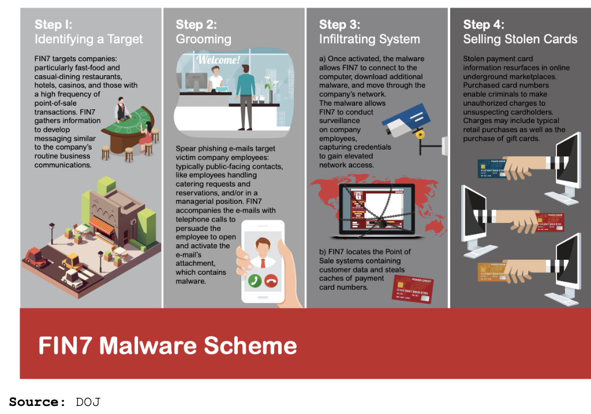

# APT Group by Name (work in progress)

Classification based on [Threat Group Cards: A Threat Actor Encyclopedia](2019/Threat_Group_Cards.pdf) by ThaiCert and the [Group](https://attack.mitre.org/groups/) pages of the MITRE ATT&CK team.

## [APT1](https://attack.mitre.org/groups/G0006)
### aka Comment Crew, Comment Group, Comment Panda, TG-8223, BrownFox, Group 3, Byzantine Hades, Byzantine Candor, Shangai Group, GIF89a

| Title | Year | Month | Source |
|----------------|--------|--------|--------|
| [Operation Oceansalt Attacks South Korea, U.S. and Canada with Source Code from Chinese Hacker Group](2018/rp-operation-oceansalt.pdf) | 2018 | Oct | McAfee |
| [Putter Panda](2014/putter-panda.pdf) | 2014 | Jun | Crowdstrike |
| [Apt1 Exposing One Of China's Cyber Espionage Units](2013/Mandiant_APT1_Report.pdf) | 2013 | Feb | Mandiant |
| [APT1s GLASSES: Watching a Human Rights Organization](2013/APT1s-GLASSES-Watching-a-Human-Rights-Organization_websitepdf.pdf) | 2013 | Feb | The Citizen Lab |
| [Apt1: Technical Backstage](2013/RAP002_APT1_Technical_backstage.1.0.pdf) | 2013 | Mar | itrust |

Other:

- https://www.fireeye.com/blog/threat-research/2014/05/the-pla-and-the-800am-500pm-work-day-fireeye-confirms-dojs-findings-on-apt1-intrusion-activity.html 
- https://krebsonsecurity.com/2014/07/hackers-plundered-israeli-defense-firms-that-built-iron-dome-missile-defense-system/
- https://blog.trendmicro.com/trendlabs-security-intelligence/the-siesta-campaign-a-new-targeted-attack-awakens/
- https://www.fireeye.com/blog/threat-research/2014/03/a-detailed-examination-of-the-siesta-campaign.html
- https://www.mcafee.com/blogs/other-blogs/mcafee-labs/operation-oceansalt-delivers-wave-after-wave/

## [APT3](https://attack.mitre.org/groups/G0022)
### aka Gothic Panda, Pirpi, UPS Team, Buckeye, Threat Group-0110, TG-0110, Group 6

| Title | Year | Month | Source |
|----------------|--------|--------|--------|
| [APT3 Adversary Emulation Plan](2017/APT3_Adversary_Emulation_Plan.pdf) | 2017 | Sep | MITRE |

Other:

- https://www.symantec.com/blogs/threat-intelligence/buckeye-windows-zero-day-exploit
- https://www.fireeye.com/blog/threat-research/2015/06/operation-clandestine-wolf-adobe-flash-zero-day.html
- https://www.recordedfuture.com/chinese-mss-behind-apt3/
- https://www.fireeye.com/blog/threat-research/2014/11/operation_doubletap.html
- https://www.symantec.com/connect/blogs/buckeye-cyberespionage-group-shifts-gaze-us-hong-kong
- https://recon.cx/2017/montreal/resources/slides/RECON-MTL-2017-evolution_of_pirpi.pdf
- https://www.fireeye.com/blog/threat-research/2014/04/new-zero-day-exploit-targeting-internet-explorer-versions-9-through-11-identified-in-targeted-attacks.html
- https://www.fireeye.com/blog/threat-research/2014/06/clandestine-fox-part-deux.html

## [APT28](https://attack.mitre.org/groups/G0007/) 
### aka Sofacy, Pawn Storm, Sednit, Strontium, Fancy Bear, Group 74, TG-4127, Tsar Team, Swallowtail, SIG40, Snakemackerel, Grizzly Steppe

| Title | Year | Month | Source |
|----------------|--------|--------|--------|
| [Operation Roman Holiday Hunting the Russian APT28 group](2018/20180713_CSE_APT28_X-Agent_Op-RomanHoliday-Report_v6_1.pdf) | 2018 | Jul | CSE Zlab |
| [LoJax: First UEFI rootkit found in the wild, courtesy of the Sednit group](2018/ESET-LoJax.pdf) | 2018 | Oct | ESET |
| [APT28: A Window into Russias Cyber Espionage Operations](2017/rpt-apt28.pdf) | 2017 | Jan | FireEye |
| [APT28: At the center of the storm. Russia strategically evolves its cyber operations](2017/APT28-Center-of-Storm-2017.pdf) | 2017 | Jan | FireEeye |
| [APT28 Under the Scope A Journey into Exfiltrating Intelligence and Government Information](2017/Bitdefender_In-depth_analysis_of_APT28_The_Political_Cyber-Espionage.pdf) | 2017 | Feb | BitDefender |
| [Dissecting the APT28 Mac OS X Payload](2017/Bitdefender-Whitepaper-APT-Mac-A4-en-EN-web.pdf) | 2017 | Feb | Bitdefender |
| [Sednit adds two zero-day exploits using Trumps attack on Syria as a decoy](2017/Sednit.eset.2017.pdf) | 2017 | May | ESET |
| [Two Years of Pawn Storm Examining an Increasingly Relevant Threat](2017/wp-two-years-of-pawn-storm.pdf) | 2017 | May | Trend Micro |
| [En Route with Sednit Part 1: Approaching the Target](2016/eset-sednit-part1.pdf) | 2016 | Oct | ESET |
| [En Route with Sednit Part 2: Observing the Comings and Goings](2016/eset-sednit-part-2.pdf) | 2016 | Oct | ESET |
| [En Route with Sednit Part 3: A Mysterious Downloader](2016/eset-sednit-part3.pdf) | 2016 | Oct | ESET |
| [Use of Fancy Bear Android Malware tracking of Ukrainian Artillery Units](2016/Crowdstrike_FancyBearTracksUkrainianArtillery.pdf) | 2016 | Dec | Crowdstrike |
| [Sofacy II Same Sofacy, Different Day](2015/cto-tib-20150420-01a.pdf) | 2015 | Apr | PWC |
| [APT28 Targets Financial Markets: Zero Day Hashes Released](2015/FSOFACY.pdf) | 2015 | May | Root9b |
| [Operation Pawn Storm Using Decoys to Evade Detection](2014/wp-operation-pawn-storm.pdf) | 2014 | Oct | Trend Micro |
| [Sofacy Phishing](2014/tactical-intelligence-bulletin---sofacy-phishing-.pdf) |  2014 | Oct | PWC |

Other:

- https://www.carbonblack.com/2019/04/05/cb-threat-intelligence-notification-hunting-apt28-downloaders/
- https://threatvector.cylance.com/en_us/home/inside-the-apt28-dll-backdoor-blitz.html
- https://www.securityartwork.es/2019/04/04/ukraine-election-2019-polls-maldoc-analysis/
- https://www.welivesecurity.com/2018/11/20/sednit-whats-going-zebrocy/
- https://blog.trendmicro.co.jp/archives/19829
- https://unit42.paloaltonetworks.com/sofacy-creates-new-go-variant-of-zebrocy-tool/
- https://unit42.paloaltonetworks.com/unit42-sofacy-continues-global-attacks-wheels-new-cannon-trojan/
- https://unit42.paloaltonetworks.com/dear-joohn-sofacy-groups-global-campaign/
- https://www.welivesecurity.com/2017/05/09/sednit-adds-two-zero-day-exploits-using-trumps-attack-syria-decoy/
- https://www.emanueledelucia.net/apt28-targeting-military-institutions/
- https://www.emanueledelucia.net/apt28-sofacy-seduploader-under-the-christmas-tree/

## [APT29](https://attack.mitre.org/groups/G0016/)
### aka Group 100, YTTRIUM, The Dukes, Cozy Bear, CozyDuke, Iron Hemlock, Minidionis, CloudLook, Grizzly Steppe	 

| Title | Year | Month | Source |
|----------------|--------|--------|--------|
| [Enhanced Analysis of GRIZZLY STEPPE Activity](2017/US-CERT-AR-17-20045_Enhanced_Analysis_of_GRIZZLY_STEPPE_Activity.pdf) | 2017 | Feb | US-CERT |
| [GRIZZLY STEPPE - Russian Malicious Cyber Activity](2016/USCERT_GRIZZLY_STEPPE.pdf) | 2016 | Dec | FBI |
| [HAMMERTOSS: Stealthy Tactics Define a Russian Cyber Threat Group](2015/rpt-apt29-hammertoss.pdf) | 2015 | Jul | FireEye |
| [The Dukes: 7 years of Russian cyberespionage](2015/dukes_whitepaper.pdf) | 2015 | Dec | F-Secure |

Other:

- https://www.crowdstrike.com/blog/bears-midst-intrusion-democratic-national-committee/
- https://www.slideshare.net/MatthewDunwoody1/no-easy-breach-derby-con-2016
- https://www.symantec.com/connect/blogs/forkmeiamfamous-seaduke-latest-weapon-duke-armory
- https://www.fireeye.com/blog/threat-research/2017/03/apt29_domain_frontin.html 
- https://www.fireeye.com/blog/threat-research/2018/11/not-so-cozy-an-uncomfortable-examination-of-a-suspected-apt29-phishing-campaign.html
- https://www.volexity.com/blog/2016/11/09/powerduke-post-election-spear-phishing-campaigns-targeting-think-tanks-and-ngos/
- https://www.fireeye.com/blog/threat-research/2017/03/dissecting_one_ofap.html
- https://www.microsoft.com/security/blog/2018/12/03/analysis-of-cyberattack-on-u-s-think-tanks-non-profits-public-sector-by-unidentified-attackers/

## [Charming Kitten](https://attack.mitre.org/groups/G0058)
### aka Newscaster, NewsBeef, Group 83, Parastoo, APT35, Phosphorus

| Title | Year | Month | Source |
|----------------|--------|--------|--------|
| [The Kittens are back in town: Charming Kitten Campaign against Academic Researchers](2019/The-Kittens-Are-Back-in-Town-Charming-Kitten-2019.pdf) | 2019 | Sep | ClearSky |
| [Charming Kitten](2017/Charming_Kitten_2017.pdf) | 2017 | Dec | ClearSky |

Other:

- https://securelist.com/freezer-paper-around-free-meat/74503/
- https://www.recordedfuture.com/iranian-cyber-operations-infrastructure/
- https://www.cyberscoop.com/apt33-iranian-hackers-fireeye/
- https://malpedia.caad.fkie.fraunhofer.de/actor/apt35
- https://securelist.com/twas-the-night-before/91599/
- https://www.kaspersky.co.uk/about/press-releases/2017_from-shamoon-to-stonedrill
- https://www.fireeye.com/blog/technical/malware-research/2014/05/operation-saffron-rose.html
- https://noticeofpleadings.com/phosphorus/

## FIN7
### Sometimes referred to as Carbanak Group, but these appear to be two groups using the same Carbanak malware

| Title | Year | Month | Source |
|----------------|--------|--------|--------|
| [Behind the CARBANAK Backdoor](2017/Behind_the_CARBANAK_Backdoor.pdf) | 2017 | Jun | FireEye |
| [The CARBANAK/FIN7 Syndicate a historical overview of an evolving threat](2017/the-carbanak-fin7-syndicate.pdf) | 2017 | Nov | RSA |
| [The Shadows of Ghosts Inside the Response of a Unique CARBANAK Intrusion](2017/the-shadows-of-ghosts-carbanak-report.pdf) | 2017 | Nov | RSA |
| [CARBANAK APT THE GREAT BANK ROBBERY](2015/Carbanak_APT_eng.pdf) | 2015 | Feb | Kaspersky |

Others:
- https://www.fireeye.com/blog/threat-research/2017/03/fin7_spear_phishing.html
- https://www.fireeye.com/blog/threat-research/2017/04/fin7-phishing-lnk.html
- https://www.fireeye.com/blog/threat-research/2017/06/behind-the-carbanak-backdoor.html
- https://www.fireeye.com/blog/threat-research/2018/08/fin7-pursuing-an-enigmatic-and-evasive-global-criminal-operation.html
- https://www.justice.gov/opa/press-release/file/1084361/download
- http://blog.morphisec.com/fin7-attacks-restaurant-industry
- https://www.fireeye.com/blog/threat-research/2017/05/fin7-shim-databases-persistence.html
- https://www.cyberscoop.com/fin7-dde-morphisec-fileless-malware/
- https://www.flashpoint-intel.com/blog/fin7-revisited-inside-astra-panel-and-sqlrat-malware/
- https://www.fireeye.com/blog/threat-research/2017/06/obfuscation-in-the-wild.html
- https://www.fireeye.com/blog/threat-research/2019/10/mahalo-fin7-responding-to-new-tools-and-techniques.html
- https://securelist.com/fin7-5-the-infamous-cybercrime-rig-fin7-continues-its-activities/90703/

## [Lazarus](https://attack.mitre.org/groups/G0032)
### aka Hidden Cobra, Guardians of Peace, Zinc, Nickel Academy, Labyrinth Chollima, Group 77, Hastai Group, Whois Hacking Team, NewRomanic Cyber Army Team, APT-C-26

| Title | Year | Month | Source |
|----------------|--------|--------|--------|
| [Full Discloser of Andariel - A Subgroup of Lazarus Threat Group](2018/Andariel_a_Subgroup_of_Lazarus.pdf) | 2018 | Jun | AhnLab |
| [Lazarus Under the Hood](2017/Lazarus_Under_The_Hood_PDF_final.pdf) | 2017 | Apr | Kaspersky |
| [Lazarus: History of mysterious group behind infamous cyber attacks](2017/Lazarus.pdf) | 2017 | May | Symantec |
| [Lazarus Arisen - full report](2017/Group-IB_on_LAZARUS.pdf) | 2017 | May | Group IB |
| [Lazarus Arisen - article](2017/LAZARUS_ARISEN.pdf) | 2017 | May | Group IB |
| [North Korea Bitten by Bitcoin Bug](2017/pfpt-us-wp-north-korea-bitten-by-bitcoin-bug.pdf) | 2017 | Dec | Proofpoint |
| [Operation Blockbuster](2016/Novetta_Operation-Blockbuster-Report.pdf) | 2016 | Feb | Novetta |

Other:

- https://objective-see.com/blog/blog_0x49.html
- https://objective-see.com/blog/blog_0x51.html
- https://blog.trendmicro.com/trendlabs-security-intelligence/mac-backdoor-linked-to-lazarus-targets-korean-users/
- https://www.symantec.com/connect/blogs/south-korean-financial-companies-targeted-castov
- https://www.symantec.com/connect/blogs/four-years-darkseoul-cyberattacks-against-south-korea-continue-anniversary-korean-war
- https://www.symantec.com/connect/blogs/trojankoredos-comes-unwelcomed-surprise
- https://www.trendmicro.com/vinfo/us/security/news/cyber-attacks/the-hack-of-sony-pictures-what-you-need-to-know
- https://unit42.paloaltonetworks.com/tdrop2-attacks-suggest-dark-seoul-attackers-return/
- https://unit42.paloaltonetworks.com/unit42-the-blockbuster-sequel/
- https://unit42.paloaltonetworks.com/unit42-blockbuster-saga-continues/
- https://blog.trendmicro.com/trendlabs-security-intelligence/new-killdisk-variant-hits-financial-organizations-in-latin-america/
- https://www.welivesecurity.com/2018/04/03/lazarus-killdisk-central-american-casino/
- https://www.mcafee.com/blogs/other-blogs/mcafee-labs/lazarus-resurfaces-targets-global-banks-bitcoin-users/
- https://www.mcafee.com/blogs/other-blogs/mcafee-labs/hidden-cobra-targets-turkish-financial-sector-new-bankshot-implant/
- https://www.mcafee.com/blogs/other-blogs/mcafee-labs/analyzing-operation-ghostsecret-attack-seeks-to-steal-data-worldwide/
- https://securelist.com/operation-applejeus/87553/
- https://www.mcafee.com/blogs/other-blogs/mcafee-labs/operation-sharpshooter-targets-global-defense-critical-infrastructure/
- https://securelist.com/cryptocurrency-businesses-still-being-targeted-by-lazarus/90019/
- https://cyware.com/news/lazarus-hacking-group-expand-their-attack-horizon-by-targeting-an-israeli-defense-company-02e2ec77
- https://www.us-cert.gov/ncas/analysis-reports/AR19-129A
- https://blogs.microsoft.com/on-the-issues/2017/12/19/microsoft-facebook-disrupt-zinc-malware-attack-protect-customers-internet-ongoing-cyberthreats/
- https://www.justice.gov/opa/pr/north-korean-regime-backed-programmer-charged-conspiracy-conduct-multiple-cyber-attacks-and
- https://www.us-cert.gov/HIDDEN-COBRA-North-Korean-Malicious-Cyber-Activity
- https://medium.com/threat-intel/lazarus-attacks-wannacry-5fdeddee476c
- https://securingtomorrow.mcafee.com/mcafee-labs/examining-code-reuse-reveals-undiscovered-links-among-north-koreas-malware-families/

## References

* [APT Groups](https://docs.google.com/spreadsheets/u/0/d/1H9_xaxQHpWaa4O_Son4Gx0YOIzlcBWMsdvePFX68EKU/pubhtml)
* [Mitre Attack Wiki Groups](https://attack.mitre.org/wiki/Groups)
* [Threat Group Cards: A Threat Actor Encyclopedia](2019/Threat_Group_Cards.pdf)
* [APT CyberCriminal Campaign Collections](https://github.com/CyberMonitor/APT_CyberCriminal_Campagin_Collections)
* [APT Report Collection](https://github.com/blackorbird/APT_REPORT)

